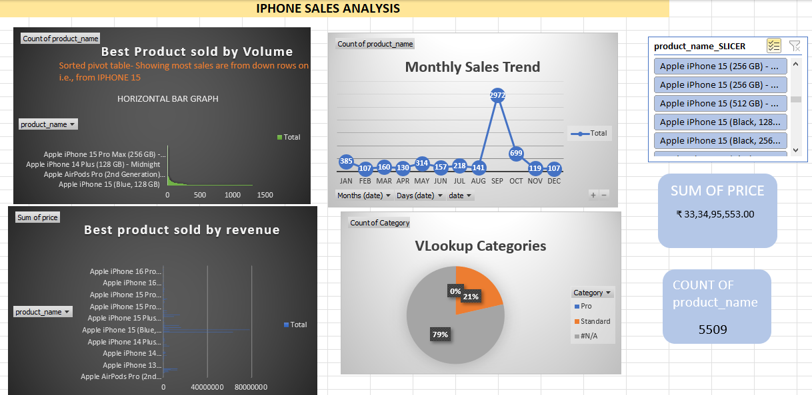
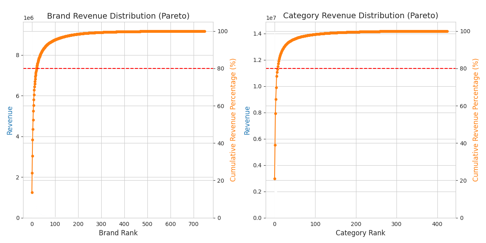
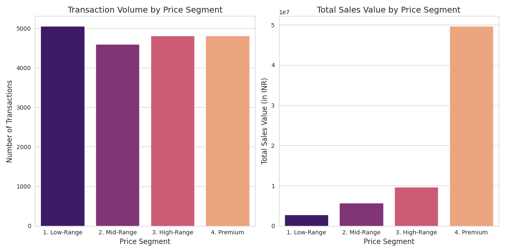

## Assignment Overview

This repository contains my solutions for the Business Analyst Intern Assignment given by Buyhatke.

The tasks evaluate analytical, problem-solving, and data-handling skills across Excel, Python, and analytical reasoning.

## Section 1 – Excel Analysis

Cleaned and organized the iPhone sales dataset.

Used Pivot Tables, VLOOKUP, Conditional Formatting for insights.

Built visualizations showing trends in demand, pricing, and performance.

📌 Deliverables: Section1_WorkBook.xlsx, Section1_Report.pdf

## Section 2 – Python Analysis

Performed exploratory data analysis (EDA) on the Audio transactions dataset using Pandas, NumPy, Matplotlib, Seaborn.

Analyzed market dynamics, price sensitivity, customer behavior, and cohorts.

Created visualizations (Pareto charts, heatmaps, funnels) to highlight insights.

📌 Deliverables: Section2_code.ipynb, Section2_Report.pdf

## Section 3 – Demographics Prediction

Designed a methodology to infer Age & Gender from transactional data.

Proposed a scoring model (rule-based + weighted signals).

Suggested validation techniques (precision, recall, confusion matrix).

📌 Deliverables: Section3_Report.pdf, Section3_code.ipynb 

## Steps to Run :-

1.Clone the repository:
git clone https://github.com/Abhiudai12/Buyhatke_BuisnessAnalyst.git  --> cd Buyhatke_BuisnessAnalyst

2.Open the Jupyter Notebook for Python analysis.

3.Excel file can be opened directly in MS Excel or Google Sheets.

✨ Key Highlights

Demonstrates synergy across Excel, Python, and business reasoning.

Combines data cleaning, visualization, and strategic recommendations.

End-to-end approach from raw data → insights → methodology.
